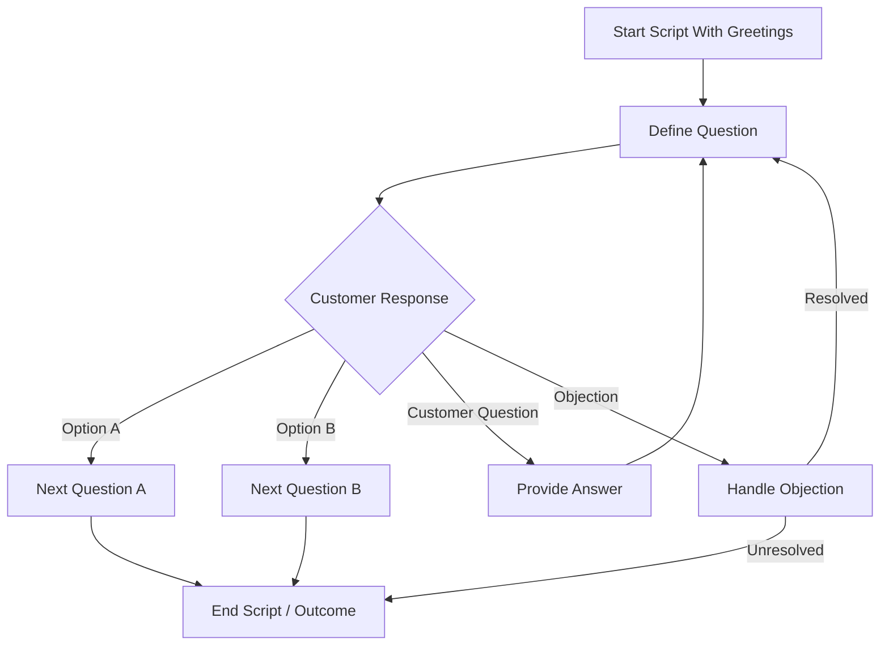

import Tabs from "@theme/Tabs";
import TabItem from "@theme/TabItem";

# Script Wizard Management

The **Script Wizard** is a guided CRM tool that streamlines the creation of call scripts by allowing users to define questions, responses, and script flow in a structured, step-by-step process. It enables teams to build consistent, effective scripts for optimized lead engagement.

To access it:  
➡️ Go to **Sales** → **Script Wizard** from the left-hand menu.

---

## 📜 Script Wizard Overview

The **Script Wizard List** provides a complete overview of all Scripts that exist in the system.

### Columns in the List

| Field                 | Description                                                                               |
| --------------------- | ----------------------------------------------------------------------------------------- |
| **Action**            | Represents available operations such as preview, edit, inline edit or assign to campaign. |
| **Name**              | Displays the title or identifier of the script.                                           |
| **Campaign Activity** | Indicates the associated campaign task or call activity.                                  |
| **Category**          | Defines the classification or type of the script.                                         |
| **Status**            | Shows the current state, such as Active, Inactive, or Draft.                              |
| **Created At**        | Timestamp showing when the record was originally created.                                 |
| **Modified At**       | Timestamp showing the latest update made to the record.                                   |

:::tip
You can **sort** columns (ascending/descending) to organize the list as needed.
:::

<figure>
  
  <figcaption>Script Wizard list view</figcaption>
</figure>

---

## 🔄 Script Creation Flow

The Script Wizard allows you to build dynamic scripts with branching logic.

---

## 🔍 Searching for Scripts

- Enter keywords in fields such as **Name**.
- Press **Enter** to run the search.
<figure>
  
  <figcaption>Search scripts</figcaption>
</figure>

---

## 🎛️ Filtering Scripts

You can filter scripts to quickly find relevant records.

Click to view available filters

- **Category** → Filter by script type.
- **Status** → View Active, Inactive, or Draft scripts.
- **Campaign Activity** → Filter by associated campaign.
- **Created Date** → Filter by creation timeframe.

<figure>
  
  <figcaption>Filter scripts</figcaption>
</figure>

---

## ➕ Add Scripts

To Create New Script follow these steps:

<Tabs>
  <TabItem value="configure" label="Configure">
    Configure your project settings, environment variables, and dependencies before proceeding to the build process.
    - Fill all the mandatory fields **(Script Name, Category, Status, Campaign and Campaign Activity)**.
    :::note
    Campaign Activity will appear only when you select a campaign in which at least one activity exist.
    :::
    - Provide the description if needed and click on next.

<figure>
  
  <figcaption>Add / Edit Script</figcaption>
</figure>

  </TabItem>

  <TabItem value="build" label="Build">
    Build and compile the application using your preferred build tools or automated pipelines.
    - Start with greeting.
    :::note
    - you can add only one greeting in a script.
    :::
    - Arrange the **questions** and **responses according to your preference.
    - click on **Next**.
    

    
Click to view additional actions you can perform 

    - You can zoom in and zoom out the page.
    - You can reset the zoom.
    - You can **Hold Shift + drag** or middle mouse button to pan.
    

  <figure>
  
  <figcaption>Add / Edit Script</figcaption>
</figure>

  </TabItem>

  <TabItem value="preview" label="Preview">
    - Preview and Finalize the call script you have created.
    - Click on Save.

<figure>
  
  <figcaption>Add Script</figcaption>
</figure>

  </TabItem>
</Tabs>

---

## ✏️ Edit Scripts

Modify existing Scripts to keep your communication strategies up to date.

Follow these steps:

- Click on pencil icon under action column for the script you want to edit.
- Make necessary changes if needed in **Configure** and click on **Next**.
- Make necessary changes if needed in **Build** for the questions and responses and click on **Next**.
- Finally **Preview** the changes and click on **Update** button.

Click to see additional action

- Additionally you can perform **inline edit** for the script you want.

<figure>
  
  <figcaption>Edit Script</figcaption>
</figure>
---

## 👁️ Previewing Scripts

Before finalizing a script, you can preview it to ensure the flow works as intended.

1. Locate the script in the list.
2. Click the **Preview** action.
3. Walk through the questions and responses as an agent would.

<figure>
  
  <figcaption>Preview Script</figcaption>
</figure>

---

## 🔗 Assigning Scripts

Scripts can be assigned to specific campaigns or leads to ensure agents use the right messaging.

### 📢 Assign to Campaign

1. Select the script(s) from the list.
2. Click **Assign to Campaign** icon.
3. Select the target campaign and confirm.

<figure>
  
  <figcaption>Assign Script</figcaption>
</figure>

### 👤 Assign to User

1. Select the Script you want to assign to the user using checkbox.
2. Click on **Assign** icon that appears beside the trash icon.
3. Select the appropriate user and confirm.

<figure>
  
  <figcaption>Assign Script</figcaption>
</figure>

---

## 🗑️ Deleting Scripts

1. Select the checkbox(es) beside the scripts you want to remove.
2. Click the **Delete** icon.
3. Confirm the action in the pop-up window.

:::warning
Deleting a script cannot be undone. Ensure the script is not currently active in an important campaign before deleting.
:::

<figure>
  
  <figcaption>Delete Script</figcaption>
</figure>
