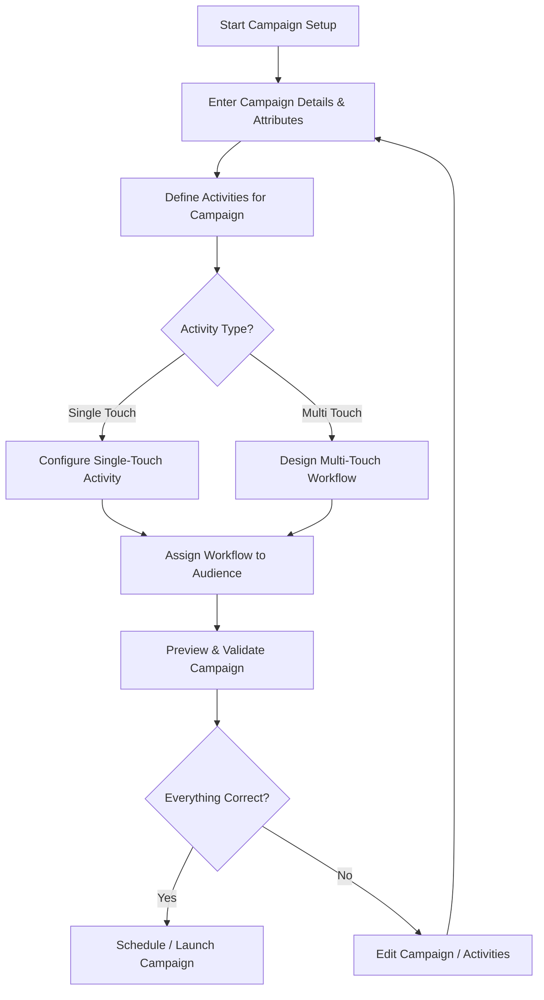

import Tabs from '@theme/Tabs';
import TabItem from '@theme/TabItem';

# 📢 Campaign Management

The **Campaign Management** module in C360 allows you to plan, launch, and monitor marketing campaigns that engage your audience through emails, webinars, and other activities.

To access it:
➡️Go to **Marketing → Campaign** from the left-hand menu.

---

## 📋 Managing Campaigns

The Campaigns section provides a clear overview of all campaigns. You can toggle between **List View** and **Grid View** for easier management.

### 🔎 Top Bar Actions

- **Search** campaigns by name
- **Add** a new campaign
- **Assign** campaigns to user groups
- **Delete** campaigns (single or bulk)
- Toggle between **List / Grid View**

> **✏️ Edit** → Pencil icon  
> **🗑️ Delete** → Trash icon

## 🖥️ Campaign Views

<Tabs>
  <TabItem value="list" label="📄 List View" default>

The **List View** displays campaigns in a structured table format for quick scanning and comparison.

| Field             | Description                          |
| ----------------- | ------------------------------------ |
| **Campaign Name** | Name of the campaign                 |
| **Description**   | Brief summary of the campaign        |
| **Created Date**  | Campaign creation date               |
| **Modified Date** | Last updated date                    |
| **Status**        | Draft / Published / Expired          |
| **Expiration**    | End date of the campaign (if set)    |
| **Actions**       | Assign, Edit, or Add/View Activities |

<figure>
  
  <figcaption>Campaign List View</figcaption>
</figure>

  </TabItem>

  <TabItem value="grid" label="🔳 Grid View">

The **Grid View** presents campaigns as visual cards with thumbnails and quick actions.

<figure>
  
  <figcaption>Campaign Grid View</figcaption>
</figure>

  </TabItem>
</Tabs>

## Campaign Flow

## 🔍 Search & Filter Campaigns

### Search Campaigns

- Enter a **campaign name** in the search bar
- Press **Enter** or click the **search icon**

<figure>
  
  <figcaption>Search campaigns by name</figcaption>
</figure>

### Filter Campaigns

You can refine campaign results using filters.

Available Filters

- **Country** → Campaign location
- **Language** → Campaign language
- **Industry** → Vertical focus (IT, Healthcare, etc.)
- **Products** → Related products
- **Audiences** → Target segments
- **Campaign Category** → Promotional, Informational, etc.
- **Status** → Draft / Published / Expired
- **Created / Modified Dates** → Time-based filtering

- **All Campaigns/ My Campaigns / Campaigns Assigned To Me**  

:::note
 - All Campaigns: Created By me/Assigned to me/Created By below users.
 - My Campaigns: Created By me
 - Campaigns Assigned To Me: The Campaign which was assiged to me by someone.
:::

<figure>
  
  <figcaption>Filter options for campaigns</figcaption>
</figure>

## 👥 Assigning Campaigns

1. Select one or more campaigns from the list.
2. Click **Assign To** in the top bar.
3. Select the appropriate **user group** and confirm the assignment.

<figure>
  
  <figcaption>Assign campaigns to a user group</figcaption>
</figure>

---

## 🗑️ Deleting Campaign

1. Select the checkbox(es) for the Campaign you want to delete.
2. Click the **Delete** icon .
3. Click on **Yes** from the confirmation pop up if you want to delete.

<figure>
  
  <figcaption>Delete selected Campaign</figcaption>
</figure>

---

## ✏️ Adding or Editing Campaigns

When creating or editing a campaign, the interface is organized into tabs. Complete the required fields (marked with \*) and click **Save** to proceed.

<Tabs>
  <TabItem value="general" label="General Info" default>

### General Information (Required Fields)

- **Campaign Name** — Title of the campaign
- **Category** — Promotional / Informational / Seasonal
- **Status** — Draft / Published / Expired
- **Description** — Brief summary of the campaign
- **Thumbnail** — Visual identifier
- **Language** — Primary campaign language
- **Estimated Budget** — Planned budget allocation
- **Expiration Date** — Campaign end date (if applicable)

<figure>
  
  <figcaption>Campaign general information</figcaption>
</figure>

  </TabItem>

  <TabItem value="attributes" label="Attributes">

### Attributes

- **Audiences** — Target segments
- **Products** — Associated products
- **Vertical Industries** — Relevant industries
- **Regions / Countries** — Target geographies

<figure>
  
  <figcaption>Campaign attributes</figcaption>
</figure>

  </TabItem>
</Tabs>

:::note
Once you save the **General Information** and **Attributes**, the **Activities** tab becomes available for configuring campaign activities.
:::

---

## 📑Campaign Activities

Each campaign can include one or more **Activities** (e.g., Emails, Webinars). Activities can be managed in **List View** or **Grid View**, and support the following actions:

- **Preview**
- **Clone**
- **Edit**
- **Delete**
- **Execute**

<Tabs>
  <TabItem value="activities-list" label="📄 List View" default>

The **List View** presents activities in a tabular format for quick scanning.

| Field                  | Description                             |
| ---------------------- | --------------------------------------- |
| **Activity Name**      | Title of the activity                   |
| **Type**               | Email / Webinar                         |
| **Status**             | Draft / Published                       |
| **Flow**               | Single Touch / Multi Touch              |
| **Created / Modified** | Timestamps for creation and last update |
| **Actions**            | Preview, Clone, Edit, Delete, Execute   |

<figure>
  
  <figcaption>Activities displayed in List View</figcaption>
</figure>

  </TabItem>

  <TabItem value="activities-grid" label="🔳 Grid View">

The **Grid View** displays activities as visual cards with key details.  
Use the **⋮ menu** on each card to access available actions:

- Edit
- View Info
- Clone
- Preview
- Delete

<figure>
  
  <figcaption>Activity actions in Grid View</figcaption>
</figure>

  </TabItem>
</Tabs>

---

## 🔎 Search & Filter Activities

### Search Activities

- Enter a **Activity name** in the search bar
- Press **Enter** or click the **search icon**

<figure>
  
  <figcaption>Search activity by name</figcaption>
</figure>

### Filter Activities

You can refine activity results using filters.

Available Filters

 **Filter** — Narrow results by:
  - **Type** (Email, Webinar, etc.)
  - **Flow** (Single / Multi Touch)
  - **Status** (Draft / Published)
  - **Date Range** (Created / Modified)

- **All Activities/ My Activities / Activities Assigned To Me**  

:::note
 - All Activities: Created By me/Assigned to me/Created By below users.
 - My Activities: Created By me
 - Activities Assigned To Me: The Activities which was assiged to me by someone.
:::

<figure>
  
  <figcaption>Filter options for activity</figcaption>
</figure>

---

## 🔄 Flow Options

Activities can follow one of two flows:

- **Single Touch** — A one-time interaction using a predefined template.
- **Multi Touch** — A sequence of multiple steps in a campaign workflow.

<figure>
  
  <figcaption>Single Touch vs. Multi Touch workflows</figcaption>
</figure>

## ➕ Adding or Editing an Activity

To create or modify an activity, navigate to the **Activities** section and click **Add Activity**.

### Required Details

When adding an activity, provide the following information:

- **Name** — a clear, descriptive title
- **Description** — purpose or context for the activity
- **Status** — set as **Draft** or **Published**
- **Flow** — choose **Single Touch** or **Multi Touch**
- **Thumbnail** — optional visual identifier

Click **Save** to finalize. Once saved, the activity can be previewed or executed directly from the **List** or **Grid** view.

---

### 📧 Single Touch Activity

- Select an existing email template from the library, or create a new one.
- Preview your configuration and click **Save**.

<figure>
  
  <figcaption>Adding a Single Touch Activity</figcaption>
</figure>

---

### 🔄 Multi Touch Activity

- Choose **Multi Touch** as the flow type.
- Click **Builder** to open the workflow canvas.
- Add steps (emails, webinars, follow-ups) and save your workflow.

<figure>
  
  <figcaption>Designing a Multi Touch workflow in the Activity Builder</figcaption>
</figure>

---

### 📝 Clone an Activity

- Click the **Clone** icon to duplicate an activity.
- The cloned version is automatically saved as **Draft** for editing.

<figure>
  
  <figcaption>Cloning an activity</figcaption>
</figure>

<figure>
  
  <figcaption>A cloned activity in Draft status</figcaption>
</figure>

---

### 👥 Assign Activities

1. Select one or more activities from the list.
2. Click **Assign To** and choose a target group.

<figure>
  
  <figcaption>Assigning activities to user groups</figcaption>
</figure>

---

## 🗑️ Deleting Activity

1. Select the checkbox(es) for the Activity you want to delete.
2. Click the **Delete** icon .
3. Click on **Yes** from the confirmation pop up if you want to delete.

<figure>
  
  <figcaption>Delete selected Activity</figcaption>
</figure>

---

## 🏗 Multi-Touch Campaign — Workflow Builder

The **Workflow Builder** allows you to design automated, multi-step campaigns that combine emails, lead updates, and conditional logic based on user behavior.

<figure>
  
  <figcaption>Workflow Builder Canvas</figcaption>
</figure>

---

### ⚙️ Workflow Components

<Tabs>
  <TabItem value="actions" label="Actions">

Actions define what happens at each step of the workflow:

- **Send Email** — deliver a selected email template to the target audience
- **Inaction (No Action) - Send Email** — follow up if the recipient does not engage
- **Update Lead** — modify lead attributes or status
- **Inaction (No Action) - Update Lead** — take an alternate step if no change occurs

<figure>
  
  <figcaption>Workflow Actions</figcaption>
</figure>

  </TabItem>

  <TabItem value="decisions" label="Decisions">

Decisions (triggers) determine the path a user follows in the workflow, based on their behavior:

- **Open Email**
- **Download Asset**
- **Submit Form**
- **Visit Landing Page**

<figure>
  
  <figcaption>Workflow Decisions</figcaption>
</figure>

  </TabItem>
</Tabs>

---

### 🛠 Building a Workflow

Follow these steps to create a simple multi-touch workflow:

1. Click **Start** — a modal displays available actions (e.g., Send Email, Update Lead).
2. Select an action and configure it:

   - **Name**
   - **Execution Timing** (immediately, after a delay, or at a specific date/time)
   - **Subject**
   - **Sender Name**
   - **Email Template** (choose from library or **Add Email**)

<figure>
  
  <figcaption>add action</figcaption>
</figure>
     

3. Preview the configuration and click **Save** to add the block to the workflow canvas.

<figure>
  
  <figcaption>Configuring an email block</figcaption>
</figure>

<figure>
  
  <figcaption>Previewing an email before saving</figcaption>
</figure>
---

### 🔀 Managing Workflow Blocks

- Add multiple **actions** and **decisions** to build complex journeys
- Hover over a block to **edit** or **remove** it
- Branch workflows to handle multiple outcomes

<figure>
  
  <figcaption>Example of a branching workflow</figcaption>
</figure>

<figure>
  
  <figcaption>Editing and managing workflow blocks</figcaption>
</figure>

---

:::note
Workflows can branch based on conditions and user decisions.  
Always use **Preview** to validate the workflow logic before executing it live.
:::

## 👁 Campaign Preview

1. Click the campaign name in the **Campaign List** to open its details.
2. Use the eye icon to preview campaign activities:
   - **Single Touch** campaigns open in a modal window.
   - **Multi Touch** campaigns open in a new browser tab.

<figure>
  
  <figcaption>Campaign details page</figcaption>
</figure>

<figure>
  
  <figcaption>Single Touch campaign preview (modal)</figcaption>
</figure>

<figure>
  
  <figcaption>Multi Touch campaign preview (new tab)</figcaption>
</figure>

## 🛠️ Before Executing a Campaign

:::note
Before executing a campaign, ensure you have the following prepared:

1. **Contact Segment / Lead List** — the audience you want to target.
2. **Channels** — such as email templates or webinar setup.
3. **Assets** — supporting materials like landing pages, forms, or creatives.
   :::

## 📤 Executing Campaigns (Sending Emails)

You can execute both **Single Touch** and **Multi Touch** campaigns. The steps below walk you through configuration, testing, audience selection, and scheduling.

---

## ✉️ Execute a Single Touch Campaign

1. **Click Execute** on the activity you want to send.
2. **Configure email settings**:
   - Email name
   - Subject line
   - From name
   - Type (Email / Webinar)
   - Preview text

<figure>
  
  <figcaption>Single Touch configuration</figcaption>
</figure>

3. **Preview and edit** the content if needed.

<figure>
  
  <figcaption>Preview and edit</figcaption>
</figure>

4. **Send a test email**:
   - Enter a test recipient address.
   - Click **Test Mail** to verify how it appears.

<figure>
  
  <figcaption>Sending a test mail</figcaption>
</figure>

5. **Choose recipients**:
   - Send to the entire group or select specific leads.
   - Add segments with **Add Segment**.
   - Import leads using a CSV file if needed.

<figure>
  
  <figcaption>Audience selection</figcaption>
</figure>

<figure>
  
  <figcaption>Upload leads (CSV)</figcaption>
</figure>

6. **Schedule the send** (optional):
   - Set a date and time for sending.

<figure>
  
  <figcaption>Scheduling a campaign</figcaption>
</figure>

7. **Confirm send**:  
   After sending, a confirmation modal appears with navigation options back to **Campaign List** or **Outgoing Campaigns**.

<figure>
  
  <figcaption>Confirmation after send</figcaption>
</figure>

---

## 🔀 Execute a Multi Touch Campaign

1. **Click Execute** to open the Builder canvas.

<figure>
  
  <figcaption>Execute on Builder canvas</figcaption>
</figure>

2. **Configure workflow blocks**:

   - Add or edit action blocks.
   - Validate the workflow.

3. Use available options:

   - **Back** — return to Campaign Preview
   - **Update & Close** — save changes and exit
   - **Update & Next** — proceed to Preview

4. **Test each email**:
   - Enter a test recipient address.
   - Send test mails to confirm content.

<figure>
  
  <figcaption>Preview and Test Mail</figcaption>
</figure>

5. **Preview stage**:
   - A carousel displays all emails in the workflow.
   - Emails that pass test verification are marked as verified.

<figure>
  
  <figcaption>Carousel of verified emails</figcaption>
</figure>

6. **Select recipients**:
   - Send to the entire group or select leads.
   - Import CSV files if required.

<figure>
  
  <figcaption>Selecting recipients</figcaption>
</figure>

7. **Confirm send**:  
   After execution, a confirmation modal appears with navigation links.

<figure>
  
  <figcaption>Send success confirmation</figcaption>
</figure>

---

## 📌 Quick Reference: Activity Management

- **View** — Activity tab inside Campaign
- **Add** — Click **Add Activity**
- **Edit / Clone / Delete** — Use the icons or top actions
- **Preview** — Eye icon
- **Execute** — Execute button per activity

<figure>
  
  <figcaption>Activity tab inside Campaign</figcaption>
</figure>
