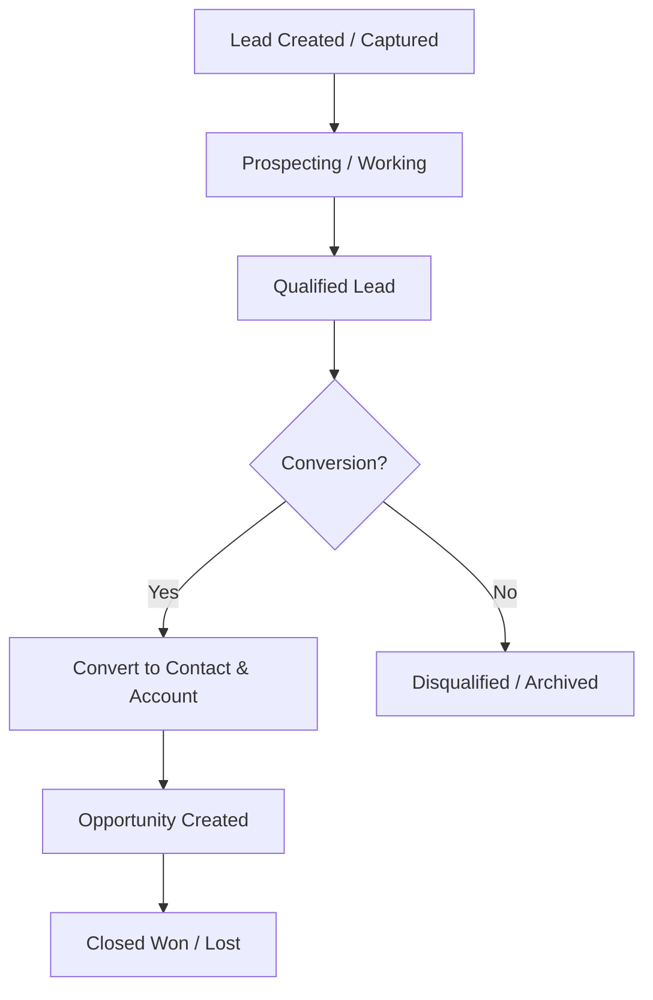
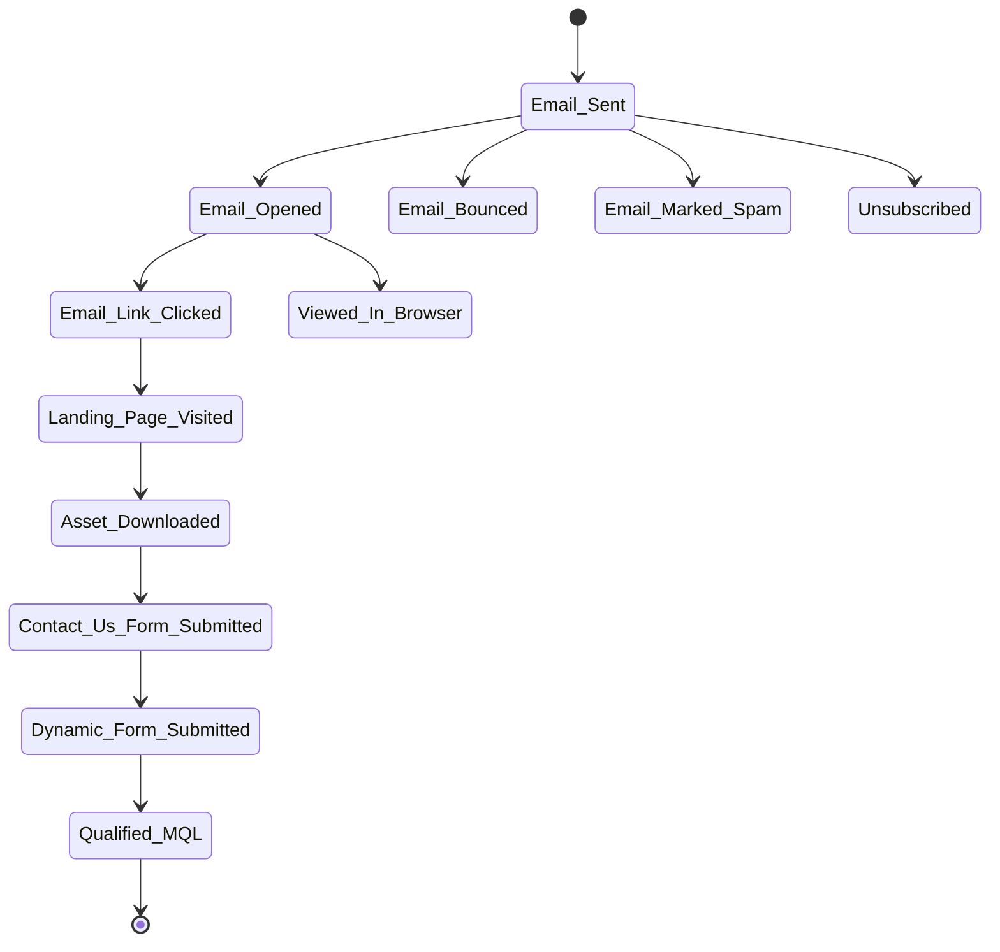
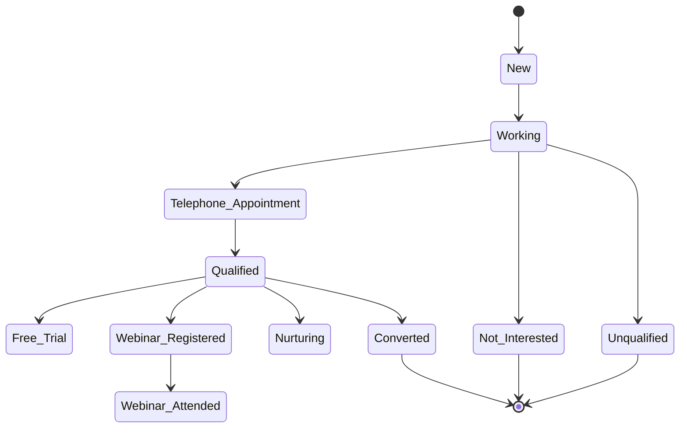
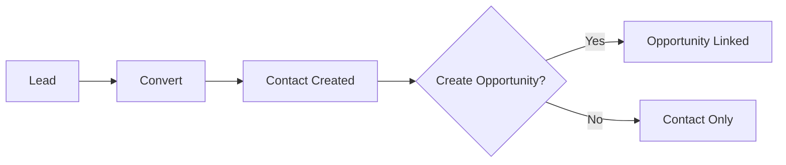
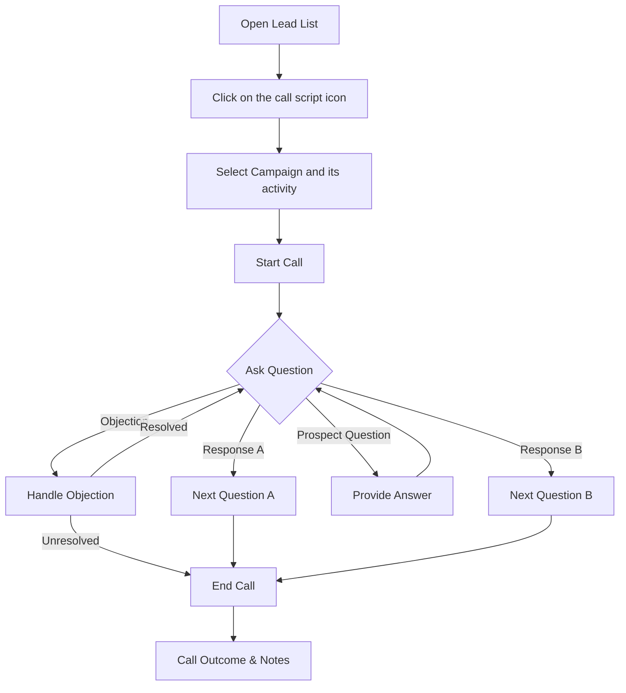

import Tabs from "@theme/Tabs";
import TabItem from "@theme/TabItem";

# Lead Management

The **Lead Management** module in C360 helps you track and manage potential customers from their **first interaction** until **conversion**.

To access it:  
➡️ Go to **Sales** → **Lead** from the left-hand menu.

---

## 📊 Leads Overview

The **Lead List** displays all existing leads with quick actions and key details.

### Columns in the List

| Column            | Description                             |
| ----------------- | --------------------------------------- |
| **Action**        | Inline edit, convert, or cancel options |
| **Name**          | Lead’s name                             |
| **Company**       | Associated company                      |
| **Phone**         | Contact number                          |
| **Title**         | Job title                               |
| **Email**         | Email address                           |
| **Industry**      | Industry type                           |
| **Call Outcome**  | Result of the most recent call          |
| **Status**        | Current status                          |
| **Lead Rating**   | Quality indicator                       |
| **Lead Stage**    | Stage in the funnel                     |
| **Lead Score**    | Engagement-based potential value        |
| **Last Activity** | Most recent interaction date            |

:::tip
You can **sort** columns (ascending/descending) and click the **maximize icon** beside the search bar to expand the list to fullscreen.
:::

<figure>
  
  <figcaption>Lead list view</figcaption>
</figure>

---

## 🔄 Lead Lifecycle

Below is the typical journey of a lead in the system:

---

## 🔍 Searching for Leads

- Enter keywords in fields such as **Name, Title, Email, Phone, Company Phone**.
- Press **Enter** or click the **Search icon** to run the search.

<figure>
  
  <figcaption>Search leads</figcaption>
</figure>

---

## 🎛️ Filtering Leads

You can filter leads by:

Click to view available filters

- **Lead Source** → Where the lead originated.
- **Lead Status** → Current working status.
- **Lead Stage** → Lifecycle stage.
- **Call Outcome** → Logged call results.
- **Country** → Geographic location of the lead.
- **Last Modified Date** → When the lead was last updated.
- **Industry** → Business vertical.

Other filter options include:

- Viewing **Active** or **Archived** Leads using the toggle switch.
- **All Leads/ My Leads / Leads Assigned To Me**

:::note

- All Leads: Created By me/Assigned to me/Created By below users.
- My Leads: Created By me
- Leads Assigned To Me: The Lead which was assigned to me by someone.
  :::

<figure>
  
  <figcaption>Filter leads</figcaption>
</figure>

---

## 📊 Lead Statuses

Leads move through **two parallel journeys**:

- **Marketing Statuses** → Engagement-driven states (emails, forms, assets, events)
- **Sales Statuses** → Qualification and conversion pipeline

---

### 📈 Marketing Flow

---

### 🏷️ Sales Flow

---

## 🗑️ Deleting Leads

1. Select the checkbox(es) beside the leads you want to delete.
2. Click the **Delete** icon .
3. Click on **Yes** from the confirmation pop up if you want to delete.

<figure>
  
  <figcaption>Delete selected leads</figcaption>
</figure>

---

---

## ⬇️ Downloading Leads

1. Select the checkbox(es) beside the leads you want to download.
2. Click the **Download icon** to export them as a spreadsheet.

<figure>
  
  <figcaption>Download selected leads</figcaption>
</figure>

---

## 👁️ Viewing Lead Details

Click a lead’s name to open the **Lead Detail** page. From here you can:

- Edit lead information
- Convert into a **Contact** (and optionally an **Opportunity**)
- Change the **Owner**
- Assign to a **User or Group**
- View related **Notes, Tasks, and Activities**

<figure>
  
  <figcaption>Lead details</figcaption>
</figure>

---

## 🔄 Converting Leads

When a lead is qualified:

1. Click **Convert to Contact**.
2. Review or edit pre-filled details.
3. Choose:
   - Create a **New Contact**
   - Link to an **Existing Contact**
   - Optionally create an **Opportunity**

:::caution
If you skip the opportunity step, only a contact will be created.
:::

<figure>
  
  <figcaption>Convert Lead</figcaption>
</figure>

---

## 📞 Call Script Wizard

The **Call Script Wizard** guides sales representatives through a structured conversation with a lead. It ensures consistency and helps capture key information during calls.

### 🏃 How to Run a Script

1. Open the **Lead List** page.
2. Click on the "Call Script" Icon under the "Action" Column for the desired lead.
3. Select the Campaign and its activity and click on **Start Call Script**.
4. Follow the on-screen prompts to ask questions and record responses.
5. Click **Finish** to save the call outcome and notes.

<figure>
  
  <figcaption>Run call script</figcaption>
</figure>

:::tip
You can find the desired lead for script execution by filtering through campaign and campaign activity. Follow the steps mentioned below:

- Click on the Filter button
- Click on the campaign dropdown.
- Select the campaign to find the related lead .

Click to view more effortless way to find lead associated with a campaign activity

- Click on the campaign activity dropdown and select the activity if you want to find the related lead for an activity.

:::

### 🔄 Script Execution Flow

:::note

- You can add note and can view the call summary in the note list for the lead.
- You can schedule appointment by selecting the "schedule appointment" option from call outcome dropdown at the end step.
- You can follow up the lead and add task / assign to a lead by selecting the "follow up" option from call outcome dropdown at the end step.
- You can send assets to the lead by selecting the "send assets" option from call outcome dropdown at the end step.
  :::

---

## 👥 Assigning / Changing Lead Owner

<Tabs>
<TabItem value="Assign" label="Assign Lead">

1. Select leads from the list.
2. Click **Assign To** → choose a user → click **Assign**.

<figure>
  
  <figcaption>Assign </figcaption>
</figure>

</TabItem>

<TabItem value="Change" label="Change Owner">

1. Select leads from the list.
2. Click **Change Owner** → select user → click **Confirm**.

<figure>
  
  <figcaption>Change Owner</figcaption>
</figure>

</TabItem>
</Tabs>

---

## ✏️ Add / Edit Leads

- **Add** → Click **Add Lead** → Fill mandatory fields (marked with `*`) → **Save**.
- **Edit** → Use the **pencil icon** (inline) or open detail page → **Edit** → **Save**.

:::info
Lead can be created or added using three ways:

1. Normal Addition from list Page.
2. Via Import Lead.
3. While adding audience Campaign (If the lead does not exist in the list).
   :::

<figure>
  
  <figcaption>Add / Edit Lead</figcaption>
</figure>

---

## 📤 Importing Leads (Excel Upload)

1. Go to **Sales → Upload List**.
2. Upload your Excel file.
   - Use the **Sample File** as a template.
3. Map columns → Click **Next**.
4. Review the summary report → Click **Import** to save.

:::tip
At the review step, you can import:

- **All records**
- **Only filtered** records (e.g., by deliverability %)
- **Specific entries**  
  :::

<figure>
  
  <figcaption>Choose Data</figcaption>
</figure>

<figure>
  
  <figcaption>Field mapping</figcaption>
</figure>

<figure>
  
  <figcaption>Confirm & Import</figcaption>
</figure>

---
