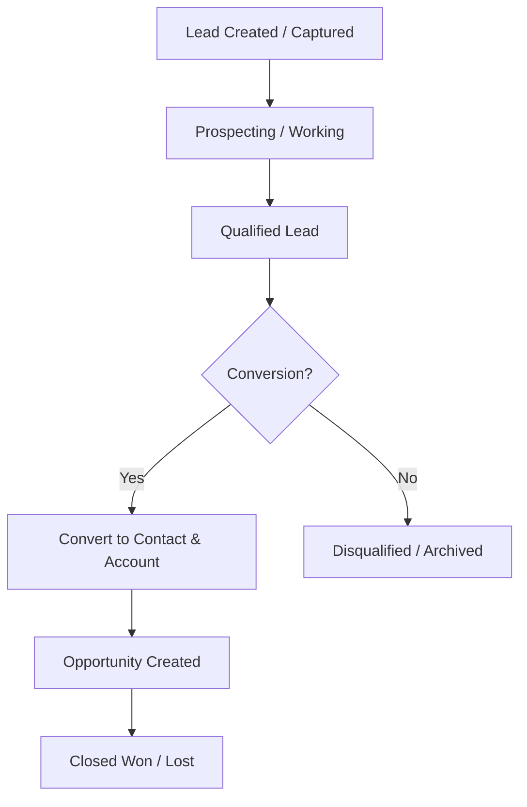
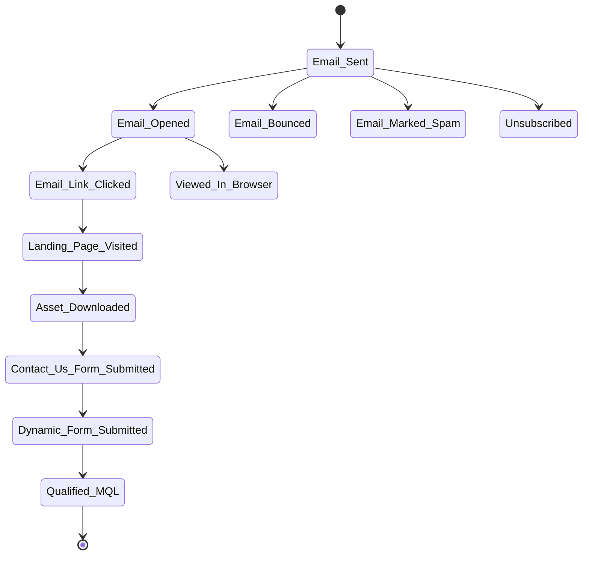
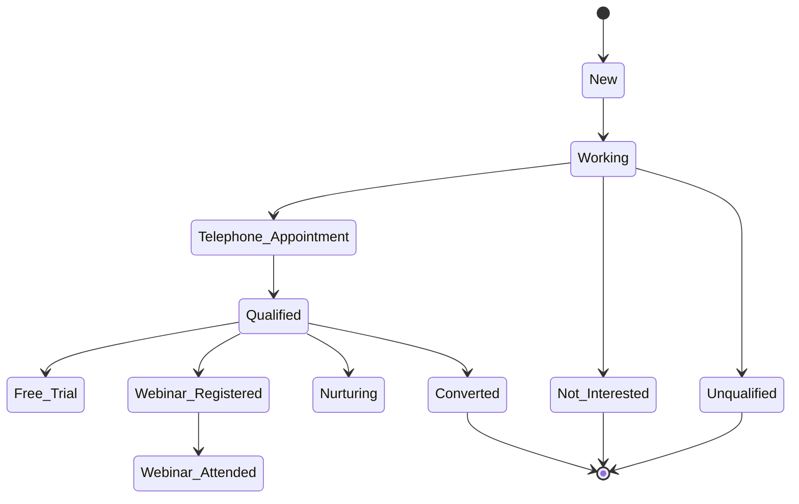
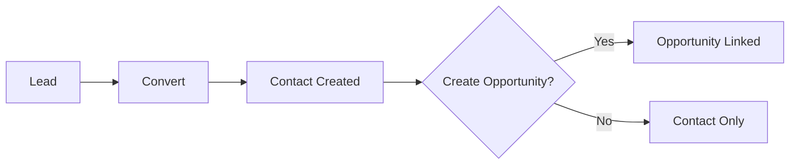
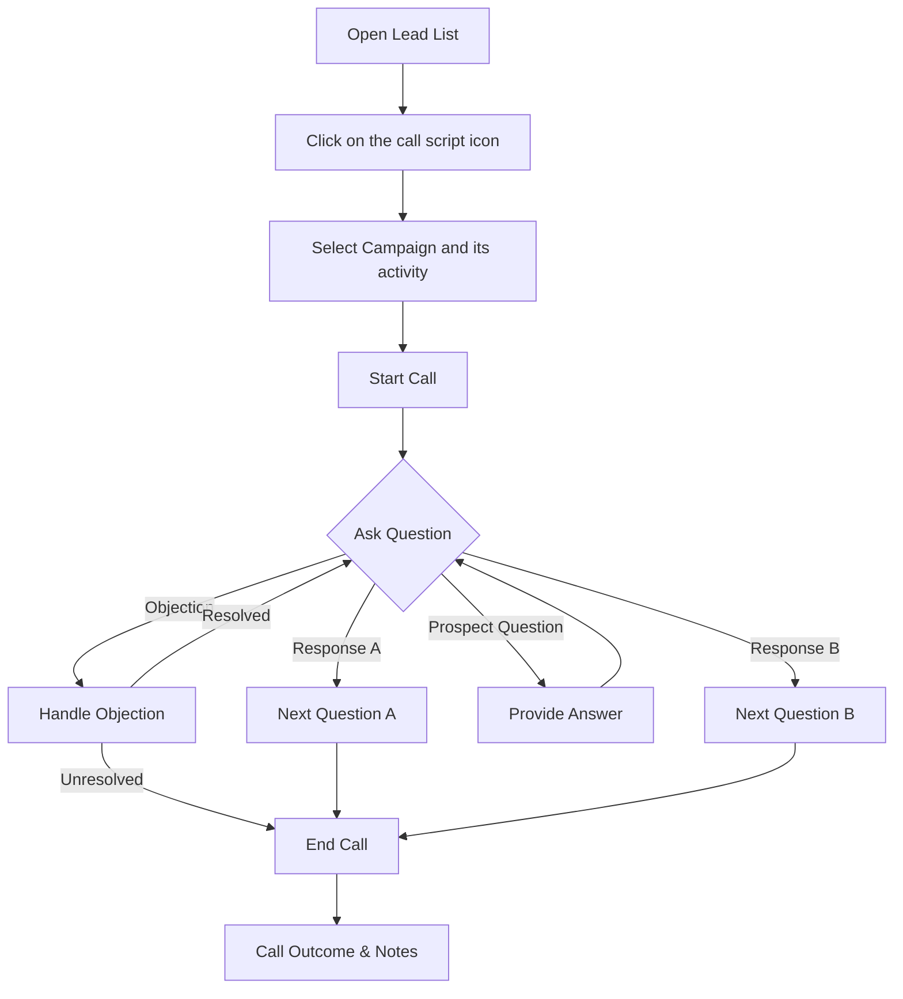

import Tabs from "@theme/Tabs";
import TabItem from "@theme/TabItem";

# Lead Management

The **Lead Management** module in C360 helps you track and manage potential customers from their **first interaction** until **conversion**.

To access it:  
➡️ Go to **Sales** → **Lead** from the left-hand menu.

---

## 📊 Leads Overview

The **Lead List** displays all existing leads with quick actions and key details.

### Columns in the List

| Column            | Description                             |
| ----------------- | --------------------------------------- |
| **Action**        | Inline edit, convert, or cancel options |
| **Name**          | Lead’s name                             |
| **Company**       | Associated company                      |
| **Phone**         | Contact number                          |
| **Title**         | Job title                               |
| **Email**         | Email address                           |
| **Industry**      | Industry type                           |
| **Call Outcome**  | Result of the most recent call          |
| **Status**        | Current status                          |
| **Lead Rating**   | Quality indicator                       |
| **Lead Stage**    | Stage in the funnel                     |
| **Lead Score**    | Engagement-based potential value        |
| **Last Activity** | Most recent interaction date            |

:::tip

- You can **sort** columns in ascending and descending order 
- Click on the **maximize icon** beside the search bar to expand the list to fullscreen.
- You can view upto 200 records at a time in the list view by selecting the **Number** from pagination dropdown.
:::

<DocImage
  src="/media/crm/lead/lead-list.png"
  alt="Lead list with sortable columns and actions"
  caption="Lead list view"
/>

:::info

- You can't revert the lead back from archive to active once it is archived.
- You can't perform any action on the archived lead except download.

:::

---

## 🔄 Lead Lifecycle

Below is the typical journey of a lead in the system:

---

## 🔍 Searching for Leads

- Enter keywords in fields such as **Name, Title, Email, Phone, Company Phone**.
- Press **Enter** or click the **Search icon** to run the search.

<DocImage
  src="/media/crm/lead/lead-search.png"
  alt="Search bar and filters for leads"
  caption="Search leads"
/>

---

## 🎛️ Filtering Leads

You can filter leads by:

Click to view available filters

- **Lead Source** → Where
  the lead originated. - **Lead Status** → Current working status. - **Lead
  Stage** → Lifecycle stage. - **Call Outcome** → Logged call results. -
  **Country** → Geographic location of the lead. - **Last Modified Date** → When
  the lead was last updated. - **Industry** → Business vertical.

Other filter options include:

- Viewing **Active** or **Archived** Leads using the toggle switch.
- **All Leads/ My Leads / Leads Assigned To Me**

:::note

- All Leads: Created By me/Assigned to me/Created By below users.
- My Leads: Created By me
- Leads Assigned To Me: The Lead which was assigned to me by someone.
  :::

<DocImage
  src="/media/crm/lead/lead-filter.png"
  alt="Filter panel with multiple criteria and applied chips"
  caption="Filter leads"
/>

---

## 📊 Lead Statuses

Leads move through **two parallel journeys**:

- **Marketing Statuses** → Engagement-driven states (emails, forms, assets, events)
- **Sales Statuses** → Qualification and conversion pipeline

---

### 📈 Marketing Flow

---

### 🏷️ Sales Flow

---

## 🗑️ Deleting Leads

1. Select the checkbox(es) beside the leads you want to delete.
2. Click the **Delete** icon .
3. Click on **Yes** from the confirmation pop up if you want to delete.

<DocImage
  src="/media/crm/lead/lead-delete.png"
  alt="Delete action for selected leads"
  caption="Delete selected leads"
/>

---

---

## ⬇️ Downloading Leads

1. Select the checkbox(es) beside the leads you want to download.
2. Click the **Download icon** to export them as a spreadsheet.

<DocImage
  src="/media/crm/lead/lead-download.png"
  alt="Download action for selected leads"
  caption="Download selected leads"
/>

:::info

- You can download upto 1000 leads at a time.

:::

---

## 👁️ Viewing Lead Details

Click a lead’s name to open the **Lead Detail** page. From here you can:

- Edit lead information
- Convert into a **Contact** (and optionally an **Opportunity**)
- Change the **Owner**
- Assign to a **User or Group**
- View related **Notes, Tasks, and Activities**

<DocImage
  src="/media/crm/lead/lead-details.png"
  alt="Lead details with info, notes, tasks and activities"
  caption="Lead details"
/>

---

## 🔄 Converting Leads

When a lead is qualified:

1. Click **Convert to Contact**.
2. Review or edit pre-filled details.
3. Choose:
   - Create a **New Contact**
   - Link to an **Existing Contact**
   - Optionally create an **Opportunity**

:::caution

If you skip the opportunity step, only a contact will be created.
:::

<DocImage
  src="/media/crm/lead/lead-convert.png"
  alt="Convert lead to contact and optionally create opportunity"
  caption="Convert Lead"
/>

---

## 📞 Call Script Wizard

The **Call Script Wizard** guides sales representatives through a structured conversation with a lead. It ensures consistency and helps capture key information during calls.

### 🏃 How to Run a Script

1. Open the **Lead List** page.
2. Click on the "Call Script" Icon under the "Action" Column for the desired lead.
3. Select the Campaign and its activity and click on **Start Call Script**.
4. Follow the on-screen prompts to ask questions and record responses.

:::note

- Additionally you can note the live conversation .
- Can capture the BANT(Budget,authority,timeline,need) along with competitor to qualify a prospect.
- Can change the Status , stage and call outcome as per the conversation.
- all above actions you can able to see in the lead note list along with call summary once call script got executed and saved successfully.
  :::

5. Click **Save** to save the call outcome and notes.

<DocImage
  src="/media/crm/lead/lead-call-script.png"
  alt="Call script wizard"
  caption="Run call script"
/>

:::info

- You can schedule appointment by selecting the "schedule appointment" option from call outcome dropdown at the end step.
- You can follow up the lead and add task / assign to a lead by selecting the "follow up" option from call outcome dropdown at the end step.
- You can send assets to the lead by selecting the "send assets" option from call outcome dropdown at the end step.
  :::

### 🔄 Script Execution Flow

:::tip

You can find the desired lead for script execution by filtering through campaign and campaign activity. Follow the steps mentioned below:

- Click on the Filter button
- Click on the campaign dropdown.
- Select the campaign to find the related lead .

Click to view more effortless way to find lead associated with a campaign activity

- Click on the campaign activity dropdown and select the activity if you want to find the related lead for an activity.

:::

--- 

## 👥 Custom Campaign Audience

You can create a **Campaign audience List** for your campaign by filtering leads based on specific criteria. This allows you to target the right leads for your marketing efforts.

- Select the "Lead" You want to add to the campaign audience.
- Click on the "Add to Campaign Audience" icon from the action column.
- Give the campaign audience list name and click on "Save" to create the campaign audience list.

<DocImage
  src="/media/crm/lead/custom-campaign-audience-lead-list.png"
  alt="custom campaign audience"
  caption="Custom Campaign Audience"
/>

---

## 👥↔️ Assigning / Changing Lead Owner

<Tabs>
<TabItem value="Assign" label="Assign Lead">

1. Select leads from the list.
2. Click **Assign To** → choose a user → click **Assign**.

 ### 👤 Individual Assign 

 Assign a selected lead manually to a specific user.

 :::note
 - Only one team member can be selected for individual assignment. Please select a single member. For multiple selections, choose Round Robin or Shark Tank.

 :::

 <DocImage
  src="/media/crm/lead/individual-assign.png"
  alt="Assign lead to user"
  caption="Individual Assign"
/>
 ### 🦈 Shark Tank 

 Distribute leads among selected users based on the Shark Tank assignment approach.
:::note

- Shark Tank: A lead is simultaneously offered to multiple eligible users, and the first user to accept the lead becomes the assignee.

:::
 <DocImage
  src="/media/crm/lead/shark-tank-assign.png"
  alt="Assign lead to user"
  caption="Shark Tank Assign"
/>
 ### 👤🔄 Round Robin 

 Automatically distribute leads sequentially among the selected users to ensure an even assignment.

#### Round Robin Assign List
- Select the users to whom leads will be assigned in a round-robin manner.

<DocImage
  src="/media/crm/lead/round-robin-assign-list.png"
  alt="Assign lead to user"
  caption="Round Robin Assign List"
/>

#### Round Robin Assign Order
- Set the order of users for lead assignment. The system will assign leads to users in the specified sequence.

<DocImage
  src="/media/crm/lead/round-robin-assign-order.png"
  alt="Assign lead to user"
  caption="Round Robin Assign Order"
/>

 :::note

 - Round Robin: Leads are automatically distributed among eligible users in a sequential rotation to maintain a balanced workload.

 :::

 :::info

- You can assign upto 500 leads at a time.

:::

</TabItem>

<TabItem value="Change" label="Change Owner">

1. Select leads from the list.
2. Click **Change Owner** → select user → click **Confirm**.

<DocImage
  src="/media/crm/lead/lead-change-owner.png"
  alt="change owner"
  caption="Change Owner"
/>

:::info

- You can transfer ownership of upto 500 leads at a time.

:::

</TabItem>
</Tabs>

---

##  ↩️👤 Revoke Lead assignment

You can revoke the assigned lead from the user and make the lead available for reassignment.

- Select the assigned lead you have assigned using individual assignment or round robin or shark tank format from the lead list.
- Click on the **Revoke** icon from the action column. 
- Check the staticstics of the revoked lead process and **confirm the revoke**.

<DocImage
  src="/media/crm/lead/lead-revoke-assignment-statistics.png"
  alt="revoke lead assignment statistics"
  caption="Revoke Lead Assignment statistics"
/>

- Check the assignement revoked from number of lead and "Confirm" the revoke process.

<DocImage
  src="/media/crm/lead/lead-revoke-assignment-confirm.png"
  alt="confirm revoke"
  caption="Confirm Revoke"
/>

- Check the successful revoked lead statistics and click on **Done**.

<DocImage
  src="/media/crm/lead/lead-revoke-assignment-success.png"
  alt="successful revoke"
  caption="Successful Revoke"
/>

:::note

- Revoke assignment will work for shark tank and round robin once the shark tank and round robin assign processes will completed.

:::

:::info

- You can revoke assignment from upto 500 leads at a time.

:::
---

## ✏️ Add / Edit Leads

- **Add** → Click **Add Lead** → Fill mandatory fields (marked with `*`) → **Save**.
- **Edit** → Use the **pencil icon** (inline) or open detail page → **Edit** → **Save**.

:::info

Lead can be created or added using three ways:

1. Normal Addition from list Page.
2. Via Import Lead.
3. While adding audience Campaign (If the lead does not exist in the list).
   :::

<DocImage
  src="/media/crm/lead/lead-add-edit.png"
  alt="Add or edit lead form"
  caption="Add / Edit Lead"
/>

