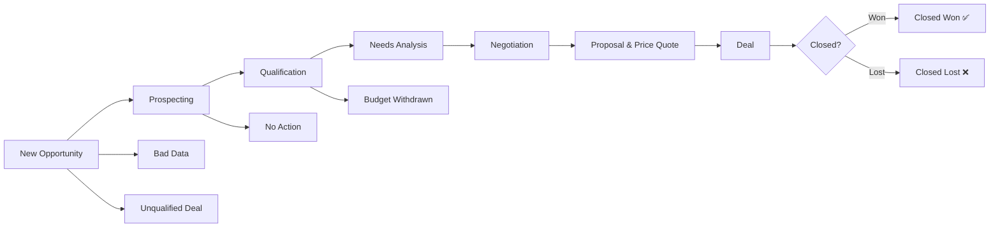

import Tabs from "@theme/Tabs";
import TabItem from "@theme/TabItem";

# Opportunity Management

The **Opportunity Management** module in **C360 CRM** helps you track, manage, and update all sales opportunities in one place.

To access it:  
➡️ Go to **Sales** → **Opportunity** from the left-hand menu.

## 📊 Opportunity Overview

The **Opportunity List** provides a complete overview of all opportunities in the system.  
You can switch between **List View** and **Grid View** depending on your preference.

---

<Tabs>
  <TabItem value="list" label="📋 List View" default>

In **List View**, opportunities are displayed in a table format with sortable columns.

### Columns in List View

| Column                 | Description                                                  |
| ---------------------- | ------------------------------------------------------------ |
| **Action**             | Inline editing options (quick update).                       |
| **Opportunity Name**   | Name of the sales opportunity.                               |
| **Stage**              | Current phase of the sales process.                          |
| **Amount**             | Estimated revenue from the opportunity.                      |
| **Close Date**         | Expected closure date.                                       |
| **Probability**        | Likelihood of closure (set automatically per stage).         |
| **Account Name**       | Associated account/customer.                                 |
| **Opportunity Type**   | Classification: _New Business_, _Renewal_, _Upsell_.         |
| **Opportunity Source** | Origin: _Referral_, _Marketing Campaign_, _Inbound Inquiry_. |
| **Modified At**        | Last modification date.                                      |
| **Last Activity**      | Most recent engagement/interaction.                          |

<DocImage
  src="/media/crm/opportunity/opportunity-list.png"
  alt="Opportunity List view"
  caption="List View — tabular format with sortable columns"
/>

  </TabItem>

  <TabItem value="grid" label="🗂 Grid View">

In **Grid View**, opportunities appear as **cards** arranged by their **stage**.

- Each stage is shown as a **chip** at the top (e.g., Prospecting, Qualification, Negotiation, Closed Won).
- You can **filter opportunities** by clicking on these stage chips.
- Each card displays quick info such as **Opportunity Name, Account, Type, Owner, and Close Date**.
- Use the **ellipsis (⋮)** on a card for quick actions like Edit, Clone, or Delete.

<DocImage
  src="/media/crm/opportunity/opportunity-grid.png"
  alt="Opportunity Grid view"
  caption="Grid View — opportunities displayed as cards grouped by stage"
/>

  </TabItem>
</Tabs>
---
## 🔄 Opportunity Lifecycle

---

## ⚡ Key Actions on the Opportunity Page

1. 🔍 **Search Opportunities** – Find records by name, phone, or mobile.
2. ➕ **Add Opportunity** – Create new opportunities.
3. 🗑 **Delete** – Select opportunities using checkboxes → click **Delete**.
4. 👤 **Assign / Change Owner** – Reassign opportunities to other users.
5. 📥 **Import** – Upload opportunities via pre-formatted file.
6. 📤 **Export (Download as Spreadsheet)** – Export selected opportunities.
7. ✏️ **Inline Editing** – Update fields directly in the table.
8. 🖥 **Maximize View** – Expand list to full screen.
9. 🗂 **Grid View** – Visualize opportunities with **color-coded stages**.

<DocImage
  src="/media/crm/opportunity/opportunity-grid.png"
  alt="Opportunity Grid View"
  caption="Grid view with stage-based color coding"
/>

---

## 🔍 Searching Opportunities

- Enter **Name**, **Phone**, or **Mobile Number** in the search bar.
- Click the **Search icon**.

<DocImage
  src="/media/crm/opportunity/opportunity-search.png"
  alt="Search Opportunities"
  caption="Search opportunities instantly"
/>

---

## 🎛️ Filtering Opportunities

Click to view available filters

- **Lead Source** → Origin
  of the opportunity (Website, Referral, Campaign, etc.) - **Opportunity Type**
  → Business type (New, Renewal, Upsell) - **Opportunity Stage** → Current sales
  stage (Prospecting → Negotiation → Closed) - **Account Name** → Specific
  account or organization

<DocImage
  src="/media/crm/opportunity/opportunity-filter.png"
  alt="Filter Opportunities"
  caption="Filter opportunities by multiple criteria"
/>

Other filter options include:

- Viewing **Active** or **Archived** Opportunities using the toggle switch.
- **All Opportunities / My Opportunities / Opportunities Assigned To Me**

:::note

- All Opportunities: Created By me/Assigned to me/Created By below users.
- My Opportunities: Created By me
- Opportunities Assigned To Me: The Opportunity which were assigned to me by someone.
  :::

---

## 🗑️ Deleting Opportunities

1. Select the checkbox(es) beside the Opportunities you want to delete.
2. Click the **Delete** icon .
3. Click on **Yes** from the confirmation pop up if you want to delete.

<DocImage
  src="/media/crm/opportunity/opportunity-delete.png"
  alt="Delete action for selected opportunity"
  caption="Delete selected opportunities"
/>

---

## 📂 Downloading Opportunities

1. Select the checkboxes for opportunities.
2. Click the **Download icon**.

<DocImage
  src="/media/crm/opportunity/opportunity-download.png"
  alt="Download Opportunities"
  caption="Export selected opportunities to Excel"
/>

---

## 📝 Viewing & Managing Opportunity Details

Each opportunity contains a **detailed view** where you can review and update key information.

### Core Details

- **Opportunity Owner** — who manages the opportunity.
- **Opportunity Name** — unique identifier/title of the deal.
- **Account Name** — the customer or account linked to the opportunity.
- **Type, Probability, Amount** — classification (e.g., New Business), closure likelihood, and deal value.
- **Assigned User** — the team member responsible.

### Actions You Can Perform

- **Edit Opportunity**: Update details, change the owner, or adjust the stage.
- **Reassign**: Allocate the opportunity to another user.
- **Add Notes & Tasks**: Log important updates or schedule follow-up actions.
- **Track Activities**: Review past engagements and interactions.

:::note

Use the **Add Note** or **Add Task** buttons in the top-right corner to capture new updates and ensure smooth follow-ups.  
:::

<DocImage
  src="/media/crm/opportunity/opportunity-details.png"
  alt="Opportunity Details"
  caption="Opportunity detail view with editable fields and related activities"
/>

---

## 👥 Assigning / Changing Opportunity Owner

<Tabs>
<TabItem value="Assign" label="Assign Opportunity">

1. Select opportunities from the list.
2. Click **Assign To** → choose a user → click **Assign**.

<DocImage
  src="/media/crm/opportunity/opportunity-assign.png"
  alt="Assign Opportunity"
  caption="Assign an opportunity to a user"
/>

</TabItem>

<TabItem value="Change" label="Change Owner">

1. Select opportunities from the list.
2. Click **Change Owner** → select user → click **Confirm**.

<DocImage
  src="/media/crm/opportunity/opportunity-change-owner.png"
  caption="Change Owner"
/>

</TabItem>
</Tabs>

---

## ➕ Add & Edit Opportunities

- **Add**:
  1. Click **Add Opportunity**
  2. Fill required fields
  3. Click **Save**
     :::info
     An Opportunity can be generated or created using two ways:
  4. Normal Addition from list Page.
  5. From Lead Conversion.

- **Edit**:
  - Use the **inline edit icon** in the list, OR
  - Open **Opportunity Details** → click **Edit**

:::info

The **Update button** activates once you make changes.  
:::

<DocImage
  src="/media/crm/opportunity/opportunity-add.png"
  alt="Add Opportunity"
  caption="Create a new opportunity"
/>
