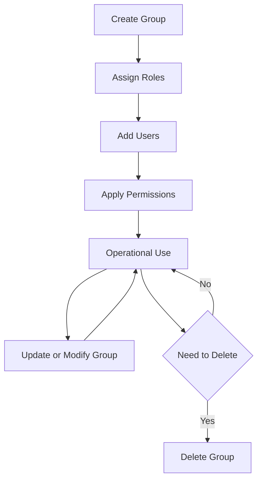

import Tabs from "@theme/Tabs";
import TabItem from "@theme/TabItem";

# 🗂 Groups

Groups are collections of users organized by **roles, departments, or shared attributes**.  
They simplify **access management, permissions control, and reporting**.

To access Groups:

1. Click **Settings** in the header.
2. Navigate to **Account Settings → Groups**.  
   _(The Groups tab is selected by default)._

---

## 🖥️ Group Views

Groups can be displayed in **List View** or **Tree View** for better organization.

<Tabs defaultValue="list">

<TabItem value="list" label="📋 List View">

- **Columns**:
  - Group Name
  - Description
  - User Count
  - Actions (Edit / Delete)
- **Top Features**:
  - **Search Bar** → Quickly find groups
  - **Add Button** → Create a new group
  - **Toggle Button** → Switch to Tree View
  - **Pencil Icon** → Inline Edit
  - **Delete Icon** → Remove Group

<DocImage
  src="/media/account-management/group/group-list.png"
  alt="Group List View"
  caption="Groups displayed in List View"
/>

</TabItem>

<TabItem value="tree" label="🌳 Tree View">

- Displays groups in a **hierarchical structure** (Parent → Child).
- **Edit** → Click pencil icon or group name.
- **Delete** → Click trash icon under Actions.

<DocImage
  src="/media/account-management/group/group-tree-view.png"
  alt="Group Tree View"
  caption="Groups displayed in Tree View"
/>

</TabItem>
</Tabs>

---

## ➕ Add / Edit a Group

Steps to Add a Group

1. Click **Add Group**.
2. Enter the following:
   - **Group Name**
   - **Description**
3. Provide the associated roles to the group.
4. Click **Save** to create the group.

<DocImage src="/media/account-management/group/group-add.png" alt="Add Group" caption="Adding a new group" />

Steps to Edit a Group

- Click the **pencil icon** in the Actions column, or
- Click the **Group Name** to open and update details.

<DocImage src="/media/account-management/group/group-edit&details.png" alt="Edit Group" caption="Editing group details" />

---

## 🔐 Assign a Role to a Group

Assign a predefined role to a group of users to centrally manage their access to modules, features, and data within the CRM.

- Go to the Add/Edit Group page.
- Select the role from the dropdown.
- Save / Update the group.

<DocImage
  src="/media/account-management/group/group-assign-role.png"
  caption="Role Assign"
/>

:::note

- You can add only one role to a group.
  :::

---

## 🔍 Search Groups

- Type a **group name** or keyword in the search bar.
- Press **Enter** to filter results.

<DocImage
  src="/media/account-management/group/group-search.png"
  alt="Search Groups"
  caption="Search for groups"
/>

---

## 🗑️ Delete Group

1. Click the **Delete** icon for the group you want to delete.
2. Click on **Yes** in the confirmation pop-up if you want to delete it.

<DocImage
  src="/media/account-management/group/group-delete.png"
  alt="Delete Group"
  caption="Delete groups"
/>

---

## 📄 View Group Details

Click a **Group Name** in List View or Tree View to open its details page.  
Here you can review:

- **User List** (Name, Email, Email Verified)
- **Assigned Permissions**

<DocImage
  src="/media/account-management/group/group-edit&details.png"
  alt="Group Details"
  caption="Group details with user list"
/>

---

## 🔄 Group Life Cycle

---

## 💡 Tips

:::tip

Use descriptive group names to simplify management.  
:::

:::warning

Deleting a group **cannot be undone**. Ensure users have alternate access paths before removal.  
:::
