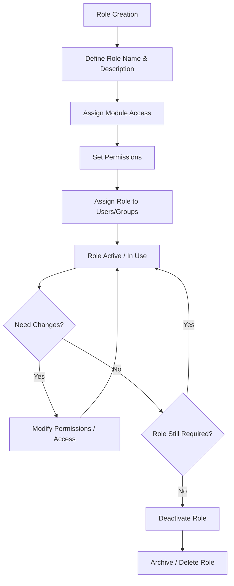

# 👤🛡️ Role

A role is a collection of permissions assigned to a user or group that defines:

- Accessible modules/features

- Allowed actions (create, view, edit, delete)

- Data visibility level (own records, team records, all records)

To access Roles:

1. Click **Settings** in the header.
2. Navigate to **Account Settings → Role**.

---

## 📋 Role List View

- **Columns**: Role Name, Description, Actions (Clone/Delete).
- **Sorting**: Click any column header to sort roles.
- **Top Features**:
  - **Search bar** → Quickly locate roles.
  - **Add button** → Create a new role.
  - **Clone Icon** → Clone an existing role.
  - **Trash Icon** → Remove a role.

<DocImage
  src="/media/account-management/role/role-list.png"
  caption="Role List"
/>

---

## ➕ Add Role

1.  Click on **Add Role**.
2.  Enter the following details:

- **Role Name**
- **Description**

3.  Enable the access permissions for the modules and features you want to grant.
4.  Click on **Save**.

<DocImage
  src="/media/account-management/role/role-add.png"
  caption="Role Add"
/>

---

## 📑 Clone Role

1.  Click on **Clone** icon.
2.  Make changes if needed.
3.  Click on **Save**.

<DocImage
  src="/media/account-management/role/role-clone.png"
  caption="Role Clone"
/>

---

## 🔍 Search Role

1.  Enter a **name or keyword** in the search bar.
2.  Press **Enter** to instantly filter results.

<DocImage
  src="/media/account-management/role/role-search.png"
  caption="Role Search"
/>

---

## 🗑️ Delete Role

1. Click on the **Delete** icon for the role you want to delete.
2. Click on **Yes** in the confirmation pop-up if you want to delete it.

<DocImage
  src="/media/account-management/role/role-delete.png"
  caption="Role Delete"
/>

---

## 🔄 Role Life Cycle

